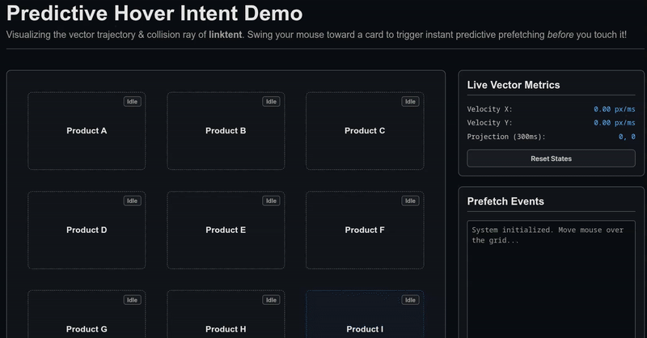

<p align="center">
  
</p>

<p align="center">
  <strong>Predict and prefetch React links <em>before</em> user hovers or clicks.</strong><br>
  Optimize web performance and UX by up to 90%.
</p>

<p align="center">
  
  
  
  
  
  
</p>

<p align="center">
  
</p>

<p align="center">
  <code>linktent</code> tracks real-time mouse velocity and trajectory vectors to intelligently anticipate which link a user is navigating towards. This allows it to initiate predictive preloading 100-300ms before hover or touch occurs, providing a zero-latency navigations experience without blindly prefetching every link in viewport.
</p>

---

## 🚀 Live Demo & Simulation

To see the trajectory calculation and predictive collision ray in action, you can run the interactive visualization locally:

```bash
# Start the local demo server
npm run demo
```
Then visit **http://localhost:3000** in your browser!

---

## 🛠️ How it works

Standard prefetching (like Next.js/Remix default link components) blindly prefetches everything on-screen, leading to massive database/API costs on scroll. Hover prefetching only gives the browser ~100ms before a click.

`linktent` tracks the mouse velocity vector:
$$\vec{v} = \left( \frac{\Delta x}{\Delta t}, \frac{\Delta y}{\Delta t} \right)$$

It projects a "collision ray" forward by 300ms. If the projected endpoint intersects with a link's bounding box, it triggers prefetching early.

## Installation

```bash
npm install linktent
# or
yarn add linktent
# or
pnpm add linktent
# or
bun add linktent
```

## Usage

### 1. Wrap your application with the provider

```tsx
import { IntentProvider } from 'linktent';

export default function App({ children }) {
  return (
    <IntentProvider>
      {children}
    </IntentProvider>
  );
}
```

### 2. Use `IntentLink` for predictive loading

```tsx
import { IntentLink } from 'linktent';
import { useQueryClient } from '@tanstack/react-query';

export const ProductCard = ({ id }) => {
  const queryClient = useQueryClient();

  return (
    <IntentLink
      href={`/product/${id}`}
      prefetchFn={() => queryClient.prefetchQuery(['product', id], fetchProduct)}
    >
      View Product
    </IntentLink>
  );
};
```

## License

MIT License - Copyright (c) foralexpet@gmail.com
